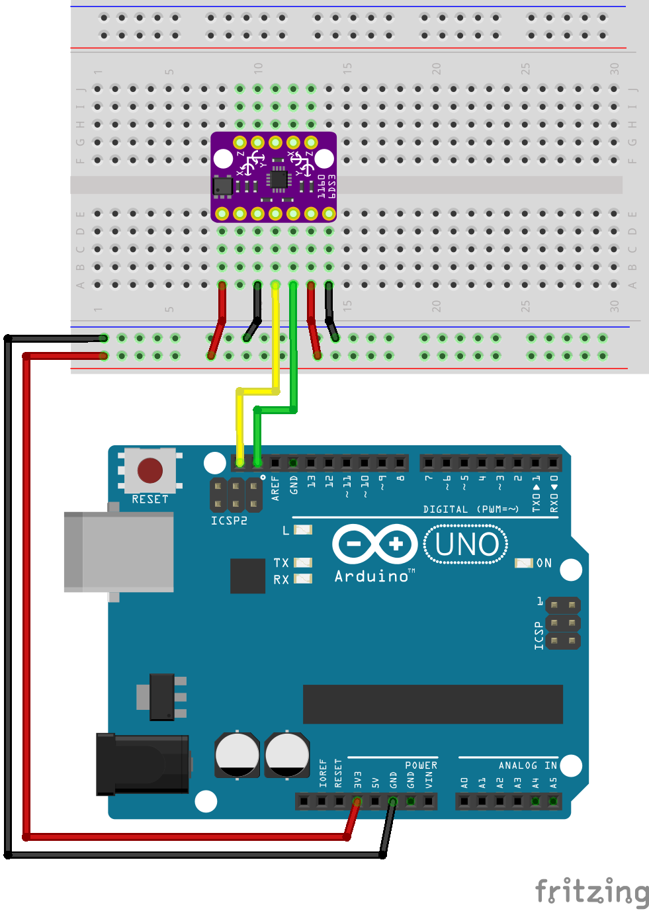
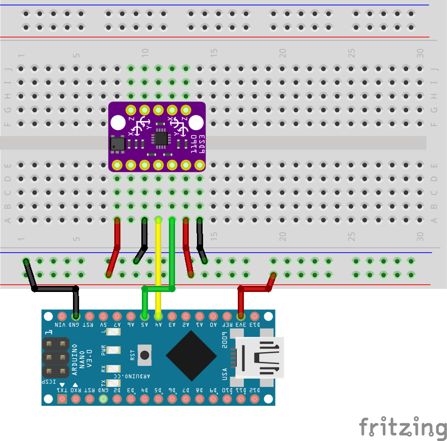

# Description

This project will demonstrate the use of the [BMI160 sensor](https://www.bosch-sensortec.com/products/motion-sensors/imus/bmi160/) breakout board using the [I2C](https://en.wikipedia.org/wiki/I%C2%B2C) connection provided by the sensor and using an [Arduino Uno R3](https://docs.arduino.cc/hardware/uno-rev3/) as the microcontroller.

# Diagram

The following diagram shows the connections neccesary to connect the [Arduino Uno R3](https://docs.arduino.cc/hardware/uno-rev3/) to the [BMI160 sensor](https://www.bosch-sensortec.com/products/motion-sensors/imus/bmi160/)

**Arduino Uno and Arduino Nano diagrams**

These diagrams was created using [Fritzing](https://fritzing.org/).

The connections displayed above are listed in the next table, these will allow to power up the sensor from the [Arduino Uno R3](https://docs.arduino.cc/hardware/uno-rev3/) and establish an [I2C](https://en.wikipedia.org/wiki/I%C2%B2C) connection for communication between the components.

| Arduino pin | Arduino function | BMI160 pin | BMI160 function | Cable color |
|-------------|------------------|------------|-----------------|-------------|
| GND         | GND              | 8          | GND             | Black       |
| 3V3         | 3V3              | 6          | VIN             | Red         |
| SCL/A5      | SCL              | 9          | SCL             | Yellow      |
| SDA/A4      | SDA              | 10         | SDA             | Green       |
|             |                  |            |                 |             |

# Code Project

## Resources
https://github.com/boschsensortec/BMI160_SensorAPI/
https://docs.arduino.cc/learn/communication/wire/
https://deepbluembedded.com/arduino-i2c-tutorial-examples/